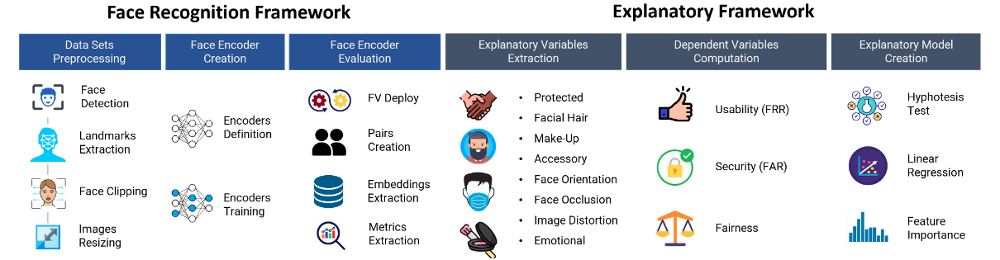
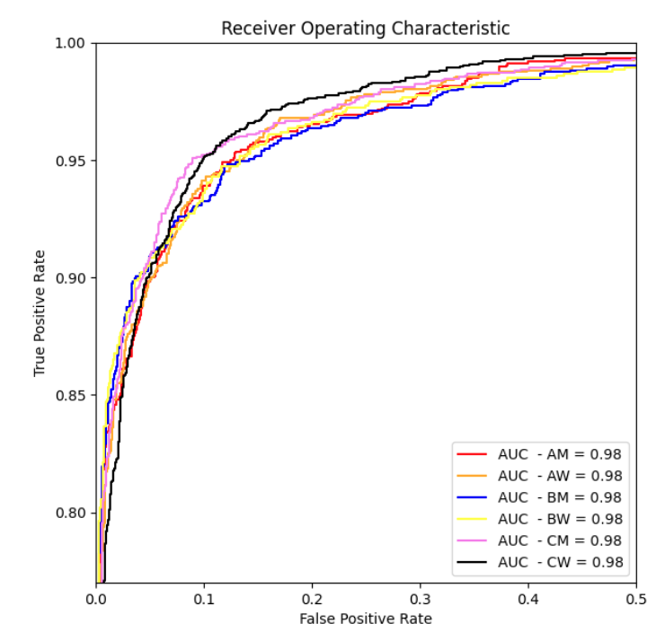
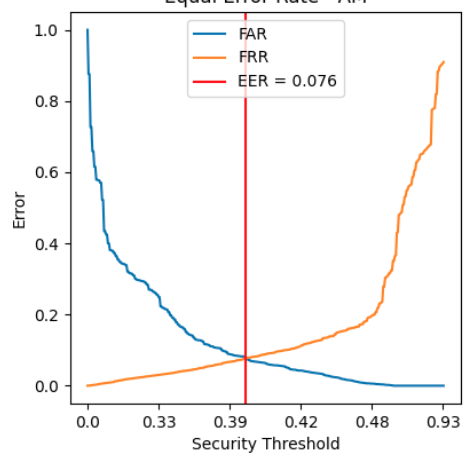
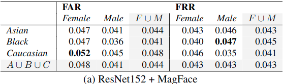
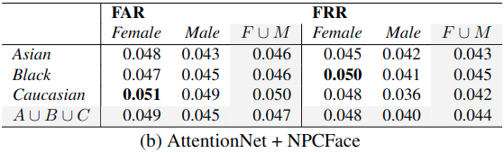
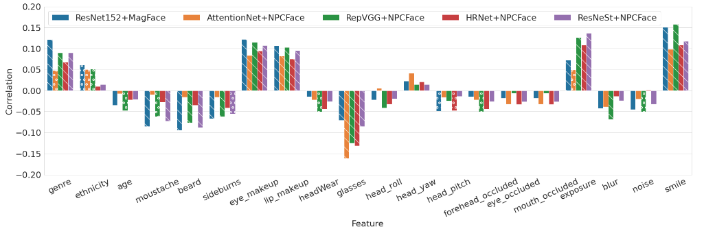

# Explaining Disparate Impacts in Face Recognition via Image Characteristics

This is the official repository of the paper entitles "Explaining Disparate Impacts in Face Recognition via Image Characteristics".
 

  

 

This is a Pytorch toolbox for Face Recognition training and testing. 
It provides a training part with various SOTA Face Recognition backbones and heads and
an evaluation part that:
- Provides evaluations of the given model(s) in order to obtain metrics like ROC curves, AUCs, EERs, EERs@FAR1% etc.
 

  

 

- Provides metrics as FAR and FRR variation across multiple factors like sex and ethnicity and their combinations
 

  

 

- Provides correlation between FAR/FRR and other sensitive/protected attributes in order to get meaningful explanations of what influences the trend of the cited metrics
 

  

 
- Provides Linear Regression modules in order to weight the given attributes accordingly to a given metric

## Dataset
 Here we provide two <a href="https://drive.google.com/drive/folders/1LNLOO157NPUOAfCWDtMxJpmDVkbn8eu4?usp=sharing" target="_blank">Datasets</a>
 (DiveFace, VGG-Face2 test set) annotated with a lot of attributes. Namely:
age, smile, moustache, beard, sideburns, mask, headWear, glasses, head_roll, head_yaw, head_pitch, eye_makeup, lip_makeup, forehead_occluded, eye_occluded, mouth_occluded, blur, exposure, noise

## Requirements
- Python >= 3.7
- PyTorch >= 1.10.0
- DeepFace == 0.0.72
- MatPlotLib == 3.5.2
- Scikit Learn == 1.0.1
- Scipy == 1.7.1
- Seaborn == 0.11.2

In order to install all the necessary prerequisites, you can simply execute the following command: \
`pip install -r requirements.txt`

## Model Training
See <a href="training/README.md" target="_blank">README</a> in <a href="training" target="_blank">training folder</a>
## Model Evaluation
 Notes to various scripts WIP

## License

This repository is published under GNU GENERAL PUBLIC LICENSE, Version 3

## Acknowledgements

This work is greatly inspired by <a href="https://github.com/JDAI-CV/FaceX-Zoo/" target="_blank">FaceX-Zoo</a>. We thank the authors a lot for their valuable efforts.

